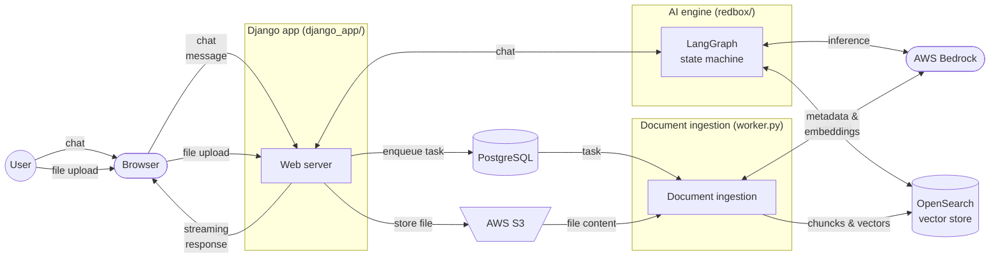
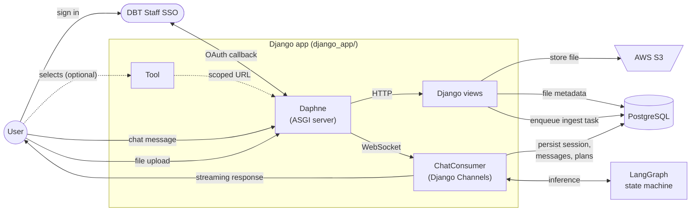
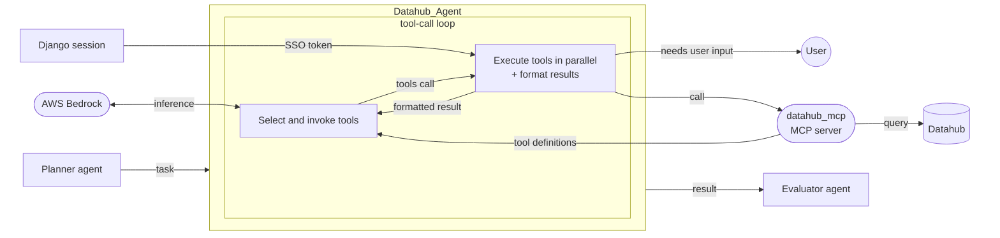
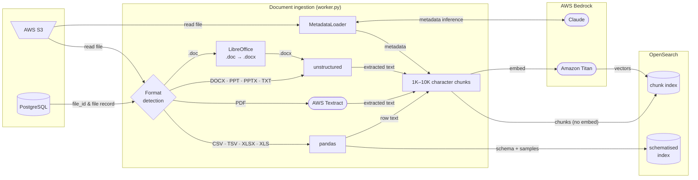

# Architecture

## Contents

- [Principles](#principles)
- [How it works at a glance](#how-it-works-at-a-glance)
- [Components](#components)
- [Django app](#django-app)
- [AI engine](#ai-engine)
- [Document ingestion](#document-ingestion)
- [Tech stack](#tech-stack)
- [Project structure](#project-structure)

## Principles

Redbox is designed to follow these core architectural principles where possible:

- **Modularity**: Components and services can be swapped out independently.
- **Cloud Agnostic**: The current deployment targets AWS, but each component can be replaced independently to suit a different cloud provider or an on-premises setup.
- **Scalability**: The system scales horizontally — additional instances can be added to handle increased load.
- **Resilience**: The system recovers from individual instance failures without losing availability.
- **Security**: Unauthorised access is prevented at all layers.
- **Simplicity**: A simple approach to data ownership lets deployers introduce their own business logic separately from the core system.

## How it works at a glance

Redbox is a [retrieval-augmented generation (RAG)](https://www.anthropic.com/engineering/contextual-retrieval) application: instead of relying only on what the LLM already knows, it looks up relevant passages from the user's uploaded files (and other sources) and feeds them into the prompt alongside the question. To make that lookup fast and meaning-aware, each document is split into smaller **chunks** and converted into **embeddings** — numeric vectors where chunks with similar meaning end up close together in vector space. At query time, the user's question is embedded the same way, and the closest chunks are retrieved and passed to the LLM as context. This is why the architecture has both an **ingestion path** (extract → chunk → embed → index) and a **chat path** (embed query → retrieve chunks → generate answer).

## Components

Redbox has three main components:

- **Django app** (`django_app/`) — a web application that manages authentication, real-time chat, and file uploads — storing files in S3 and queuing ingestion tasks in PostgreSQL
- **Document ingestion** (`django_app/redbox_app/worker.py`) — a background process that extracts and chuncks the file uploads, generates embeddings using [Amazon Titan Embed Text v2](https://aws.amazon.com/bedrock/titan/) via [AWS Bedrock](https://aws.amazon.com/bedrock/), and indexes them into [OpenSearch](https://opensearch.org/)
- **AI engine** (`redbox/`) — a [LangGraph](https://langchain-ai.github.io/langgraph/) state machine that generates responses using [Claude 3.7 Sonnet](https://www.anthropic.com/claude) via AWS Bedrock and retrieves relevant document chunks from OpenSearch



The sections below cover each component in detail, followed by the full [tech stack](#tech-stack) and [project structure](#project-structure).

## Django app

The `django_app/` directory contains both the server-side application and the browser-side chat UI. The frontend (`django_app/frontend/`) is a set of [Web Components](https://developer.mozilla.org/en-US/docs/Web/API/Web_components) written in JavaScript and bundled by [Parcel](https://parceljs.org/). [WhiteNoise](https://whitenoise.readthedocs.io/) serves the compiled assets as static files, which execute client-side in the browser.

The server (`django_app/redbox_app/`) runs behind [Daphne](https://github.com/django/daphne), an [ASGI](https://asgi.readthedocs.io/) server. ASGI is the async successor to WSGI and supports long-lived connections like [WebSockets](https://en.wikipedia.org/wiki/WebSocket) alongside regular HTTP. WebSockets are used here rather than HTTP because the LLM streams responses token-by-token, whereas HTTP would require buffering the entire answer before sending it.

Each incoming chat message is handled by [`ChatConsumer`](../../django_app/redbox_app/redbox_core/consumers.py), a [Django Channels](https://channels.readthedocs.io/) `AsyncWebsocketConsumer`. Channels is Django's extension for WebSockets and other long-lived async connections. It calls the AI engine's LangGraph state machine, persists chat sessions, messages, citations, and agent plans to PostgreSQL, and pushes tokens and events back to the browser in real time.

Authentication is handled by [`django-staff-sso-client`](https://github.com/uktrade/django-staff-sso-client) (DBT Staff SSO via OAuth). A custom `TokenCaptureBackend` extends the SSO backend to capture the OAuth token into the session for downstream use.

File uploads follow a different path from chat messages. Ingestion can take minutes, so it runs out-of-band: a Django [view](http://docs.djangoproject.com/en/6.0/topics/http/views/) (an HTTP request handler) stores the file in S3, writes a *task* row to PostgreSQL describing the work, and returns immediately. A separate **worker** process picks the task up and runs it — see [Document ingestion](#document-ingestion). This producer/worker pattern is implemented by [Django-Q2](https://django-q2.readthedocs.io/), which uses PostgreSQL as the task store and so avoids the need for a separate message broker (e.g. Redis or RabbitMQ).

File uploads can optionally be scoped to a [`Tool`](../../django_app/redbox_app/redbox_core/models.py) — a named workspace that bundles a knowledge base (uploaded files), team/user access controls, and a set of AI agents under a shared URL (`/tools/<slug>/`). Different teams can have separate Tools for different purposes (e.g. "Ministerial Submissions", "Legislation Search").



## AI engine

The `redbox/` directory defines the AI engine: a [LangGraph](https://langchain-ai.github.io/langgraph/) state machine implemented using [`StateGraph`](https://langchain-ai.github.io/langgraph/concepts/low_level/#stategraph). A LangGraph state machine is a directed graph of nodes that each read and update a shared state object, with edges deciding which node runs next — a structure that lets the engine orchestrate LLM calls, retrieval, and agent coordination in a single flow. It receives a chat message from `ChatConsumer` and produces a streamed response.

The state machine routes the message to one of several subgraphs. Following the [LangGraph workflow/agent distinction](https://docs.langchain.com/oss/python/langgraph/workflows-agents), these fall into two categories: **workflows**, where the execution path is predetermined, and **agents**, where an LLM dynamically decides what to do next. The default route is `newroute`, a [multi-agent graph](https://docs.langchain.com/oss/python/langchain/multi-agent) used for research described [below](#research-multi-agent-graph). Users can instead prefix their message with `@<route>` to invoke one of the workflows below, which are faster and cheaper and give explicit control over retrieval strategy.

| Workflow | Behaviour |
| --- | --- |
| `@search` | Embeds the query, retrieves the most relevant chunks from the user's selected files, and answers with structured citations |
| `@summarise` | Retrieves large (up to 300K token) full-document chunks and applies map-reduce summarisation |
| `@chat` | Plain LLM chat with no document retrieval |

### Research multi-agent graph (@newroute)

The research graph uses a [router pattern](https://docs.langchain.com/oss/python/langchain/multi-agent/router) with multiple [agents](https://docs.langchain.com/oss/python/langchain/agents) to support more complex queries. A Planner breaks the query into tasks, Workers gather information via [agent tools](https://docs.langchain.com/oss/python/langchain/tools) — searching documents, querying data, or fetching from external APIs — and an Evaluator synthesises the results, with raw source documents returned as citations.

| Agent | Role | Purpose | Agent tools |
| --- | --- | --- | --- |
| `Planner_Agent` | Planner | Generates a task plan for the user to approve or modify | — |
| `Internal_Retrieval_Agent` | Worker | KNN search over user-uploaded files | `search_documents` |
| `Knowledge_Base_Retrieval_Agent` | Worker | Search and SQL query over Tool knowledge base files (tabular and non-tabular) | `search_knowledge_base`, `query_tabular_knowledge_base_file` |
| `Tabular_Agent` | Worker | SQL queries against user-uploaded CSV and Excel files | `query_tabular_file` |
| `Summarisation_Agent` | Worker | Full-document summarisation via a retrieval subgraph; streams result directly to the user | — |
| `External_Retrieval_Agent` | Worker | Wikipedia and gov.uk search | `search_wikipedia`, `search_govuk` |
| `Web_Search_Agent` | Worker | General web search | `web_search` |
| `Legislation_Search_Agent` | Worker | legislation.gov.uk search | `legislation_search` |
| `Artifact_Builder_Agent` | Worker | Retrieve artifact templates (files prefixed `Artifact_`) from the knowledge base | `retrieve_specific_files_knowledge_base` |
| `Submission_Checker_Agent` | Worker | Evaluate and check ministerial submissions; provides structured quality assessment | `retrieve_document_full_text`, `retrieve_knowledge_base`, `retrieve_document_from_prompt` |
| `Submission_Question_Answer_Agent` | Worker | Answer questions about submissions and follow-up questions on prior evaluations | `retrieve_document_full_text`, `retrieve_knowledge_base`, `retrieve_document_from_prompt` |
| `Datahub_Agent` | Worker | Query company data from Datahub via MCP (see below) | Datahub MCP tools |
| `Evaluator_Agent` | Evaluator | Synthesises worker results into a final response | — |

### MCP (Model Context Protocol)

Worker agents can use [MCP](https://modelcontextprotocol.io/) to call external services. Redbox integrates MCP via [`langchain-mcp-adapters`](https://github.com/langchain-ai/langchain-mcp-adapters) to expose those services as agent tools. Three MCP servers are configured in `redbox/models/settings.py`; only `datahub_mcp` is currently wired to an agent.

The `Datahub_Agent` runs a tool-calling loop up to a set number of iterations: the LLM selects tools, executes them in parallel, formats each result, and feeds it back until it has enough information to produce a final answer. Each tool execution opens a fresh MCP session authenticated with the user's SSO Bearer token. If a tool call requires clarification, the agent pauses and surfaces the question directly to the user. The final response is parsed and formatted as documents with deep links — URLs that point directly to the relevant record or page within Datahub.



## Document ingestion

Document ingestion is the **ingestion path** introduced earlier — the offline pipeline that prepares an uploaded file so the AI engine can later retrieve relevant passages from it. It is triggered by the task that the Django view enqueued on upload, and runs in the Django-Q2 worker process. The worker pulls the next task from PostgreSQL, looks up the file in S3, extracts its text using a format-specific tool, uses an LLM to generate file-level metadata, splits the text into chunks, embeds those chunks, and indexes both the chunks and their vectors in OpenSearch. When the pipeline finishes it writes the final status — `complete` or `errored` — back to PostgreSQL, which the UI polls to show progress.



**Text extraction**: PDF text is extracted using [AWS Textract](https://aws.amazon.com/textract/), which handles both native-text and scanned PDFs via an async job. Other formats (DOCX, PPTX, TXT) are handled by [unstructured](https://github.com/Unstructured-IO/unstructured); `.doc` files are first converted to `.docx` via LibreOffice; tabular files are parsed by pandas.

**Metadata extraction**: `MetadataLoader` runs Claude 3 Sonnet over the first 10K characters of each file to generate a name, description, and keywords. This metadata is embedded into every chunk and used by agents to understand what files are available.

**Indexing**: Chunks are indexed in OpenSearch in two ways:

- **With embeddings** — 1024-dimension vectors generated by [Amazon Titan Embed Text v2](https://aws.amazon.com/bedrock/titan/) via AWS Bedrock, for [KNN semantic search](https://opensearch.org/docs/latest/search-plugins/knn/index/) used by `@search` and the research agents
- **Without embeddings** — for full-text retrieval during whole-document summarisation via `@summarise`

**Tabular files**: CSV, TSV, and Excel files are additionally parsed by pandas to extract column schemas and row samples, stored in a separate schematised OpenSearch index (`redbox-schematised`). At query time, the `Tabular_Agent` and `Knowledge_Base_Retrieval_Agent` (see [AI engine](#ai-engine)) reconstruct a DuckDB database from these schemas and execute agent-generated SQL against it.

## Tech stack

| Layer | Technology |
| --- | --- |
| LLM | [AWS Bedrock](https://aws.amazon.com/bedrock/) — [Claude 3.7 Sonnet](https://www.anthropic.com/claude) (primary), Claude 3 Sonnet (metadata extraction) |
| Embeddings | [Amazon Titan Embed Text v2](https://aws.amazon.com/bedrock/titan/) (1024-dim) |
| AI orchestration | [LangGraph](https://langchain-ai.github.io/langgraph/) + [LangChain](https://python.langchain.com/) + [MCP](https://modelcontextprotocol.io/) (`langchain-mcp-adapters`) |
| Vector store | [OpenSearch](https://opensearch.org/) (KNN search with Gaussian score boosting; separate schematised index for tabular column schemas) |
| Tabular query engine | [DuckDB](https://duckdb.org/) (in-process SQL queries over CSV and Excel data) |
| Document processing | [AWS Textract](https://aws.amazon.com/textract/) (PDF extraction), [unstructured](https://github.com/Unstructured-IO/unstructured) (DOCX, PPTX, TXT extraction), [LibreOffice](https://www.libreoffice.org/) (`.doc` → `.docx`) |
| Backend framework | [Django 5](https://www.djangoproject.com/) + [Django Channels](https://channels.readthedocs.io/) |
| ASGI server | [Daphne](https://github.com/django/daphne) + [WhiteNoise](https://whitenoise.readthedocs.io/) (static files) |
| Authentication | `django-staff-sso-client` (DBT Staff SSO, primary)
| Email | [GOV.UK Notify](https://www.notifications.service.gov.uk/) (`django-gov-notify`) |
| Feature flags | [Django-Waffle](https://waffle.readthedocs.io/) |
| Admin dashboards | [Plotly Dash](https://dash.plotly.com/) (`django-plotly-dash`) |
| File storage | [AWS S3](https://aws.amazon.com/s3/) |
| Relational database | [PostgreSQL](https://www.postgresql.org/) |
| Task queue | [Django-Q2](https://django-q2.readthedocs.io/) |
| Frontend | Web Components ([Parcel](https://parceljs.org/)-bundled), JavaScript, Sass (`django-libsass`), [GOV.UK Frontend](https://frontend.design-system.service.gov.uk/) 5.10, [Playwright](https://playwright.dev/) (E2E tests) |
| Observability | [Sentry](https://sentry.io/), [Datadog](https://www.datadoghq.com/) (`ddtrace`), [OpenTelemetry](https://opentelemetry.io/) |
| Infrastructure | [Docker](https://www.docker.com/), [AWS ECS](https://aws.amazon.com/ecs/) + [Terraform](https://www.terraform.io/) |

---

## Project structure

```txt
redbox/
├── django_app/                      # Django web application
│   ├── frontend/                    # Parcel-bundled web components
│   │   ├── src/                     # Web component source (JS/CSS)
│   │   └── tests-web-components/    # Web component tests
│   ├── redbox_app/                  # Django application package
│   │   ├── redbox_core/             # Core Django app
│   │   │   ├── consumers.py         # WebSocket handler (chat entry point)
│   │   │   ├── models.py            # ORM models (File, Chat, Citation, …)
│   │   │   ├── views/               # HTTP views
│   │   │   ├── migrations/          # Database migrations
│   │   │   └── management/          # Management commands
│   │   ├── settings.py
│   │   ├── urls.py
│   │   └── worker.py                # Ingestion worker
│   ├── static/                      # Compiled static assets
│   ├── tests/                       # Django app test suite
│   ├── manage.py
│   ├── pyproject.toml
│   └── Dockerfile
├── redbox/                          # AI engine
│   ├── redbox/                      # Python package
│   │   ├── graph/                   # LangGraph state machines and agents
│   │   │   ├── root.py              # Graph definition — nodes, edges, routing
│   │   │   ├── agents/              # Agent implementations (workers, planner, …)
│   │   │   └── nodes/               # Individual graph node functions
│   │   ├── api/                     # API wrappers and streaming callbacks
│   │   ├── chains/                  # LLM chains and ingestion logic
│   │   ├── loader/                  # Document loaders and preprocessing
│   │   ├── models/                  # Pydantic data models and settings
│   │   ├── retriever/               # OpenSearch retrieval and query builders
│   │   ├── test/                    # Shared test fixtures and helpers
│   │   ├── app.py                   # Redbox class — main entry point
│   │   └── transform.py
│   ├── tests/                       # Library test suite
│   └── pyproject.toml
├── tests/                           # End-to-end / integration tests
├── docs/                            # Project documentation (MkDocs)
├── notebooks/                       # Jupyter notebooks
├── utilities/                       # Developer utilities (e.g. draw_graph.py)
├── docker-compose.yml
├── pyproject.toml
├── Makefile
└── README.md
```

### Key files for understanding the codebase

| File | Purpose |
| --- | --- |
| [`django_app/redbox_app/redbox_core/consumers.py`](./django_app/redbox_app/redbox_core/consumers.py) | WebSocket handler — entry point for all chat messages |
| [`redbox/redbox/app.py`](./redbox/redbox/app.py) | `Redbox` class — wires up the LangGraph graph, retrievers, and agent tools |
| [`redbox/redbox/graph/root.py`](./redbox/redbox/graph/root.py) | Graph definition — nodes, edges, and route branching |
| [`redbox/redbox/graph/agents/workers.py`](./redbox/redbox/graph/agents/workers.py) | Worker agent execution — how a task is run with tool calls |
| [`redbox/redbox/retriever/retrievers.py`](./redbox/redbox/retriever/retrievers.py) | OpenSearch retriever — KNN search with filters and Gaussian boosting |
| [`django_app/redbox_app/worker.py`](./django_app/redbox_app/worker.py) | Ingestion worker — preprocessing, chunking, embedding, and indexing |
