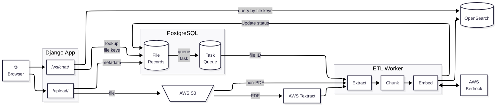

This Mermaid diagram doesn't render in GitHub because it uses the 
[elk layout](https://mermaid.js.org/intro/syntax-reference.html#supported-layout-algorithms) which is more sophisticated but not supported by
[GitHub](https://github.com/orgs/community/discussions/138426).

If you want to make a change to this diagram, you can paste to https://mermaid.live/ 
or use the VSCode [Mermaid extension](https://marketplace.visualstudio.com/items?itemName=bierner.markdown-mermaid)

